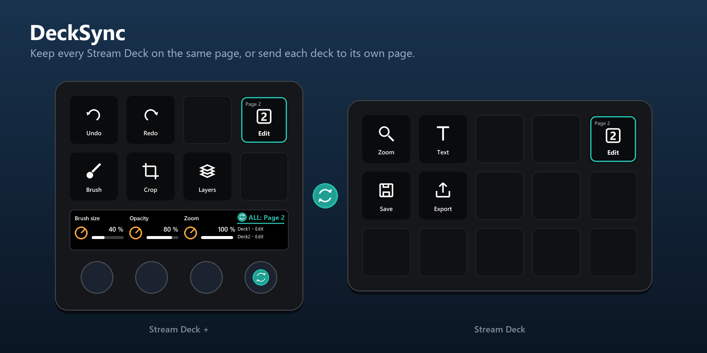
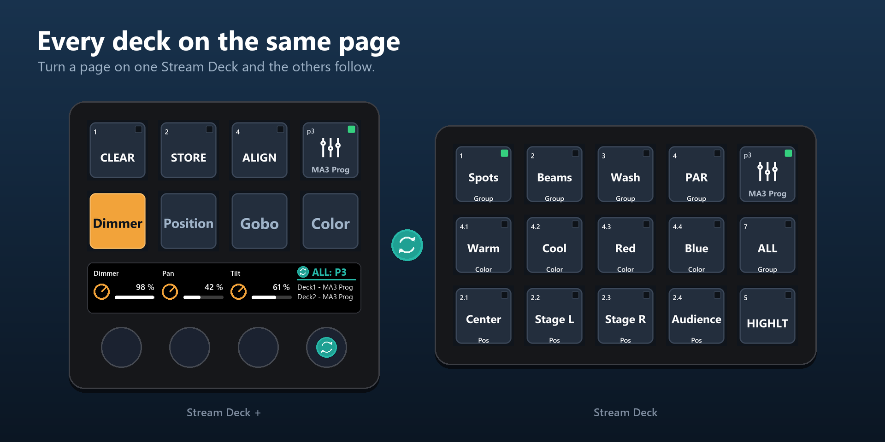
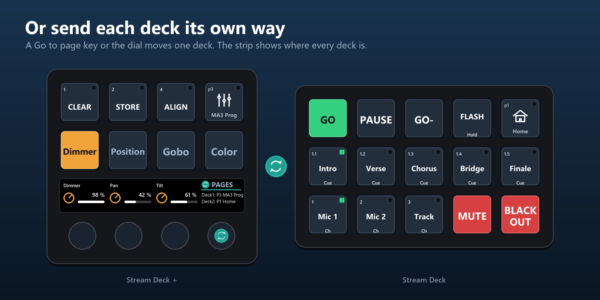
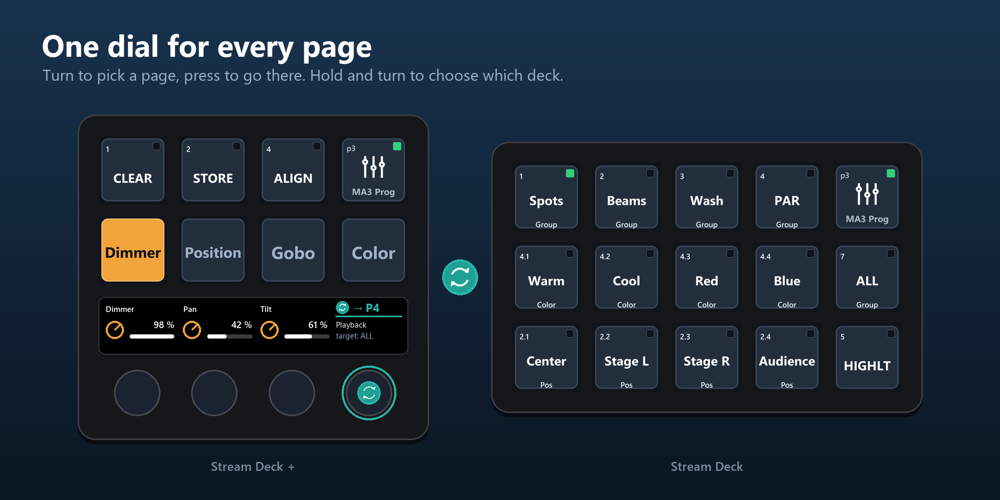

# DeckSync

**Keep every Stream Deck on the same page, or send each deck to its own page.**

DeckSync is a plugin for the Elgato Stream Deck app. Connect two or more Stream Decks to the same computer, and DeckSync keeps their pages in step: turn a page on one deck and the others follow. When you want them apart, a single key or a dial sends each deck to the page you choose.



## Features

- **Follow mode.** Every page in a DeckSync profile carries a page marker. When a page appears on one deck, the other decks jump to the same page. No loops, no polling.
- **Page indicator.** A display key that shows which page any deck is on, name and number, wherever you put it.
- **Folders.** Folder and Back keys that open a page on one deck only, styled with the page's own name and icon.
- **Go to page.** One key sends each deck to its own page, for example the 15-key deck to page 2 while Stream Deck + stays on page 1.
- **Page dial** (Stream Deck +). Turn to pick a page, press to go there, hold and turn to choose the target (ALL decks or a single one). The touch strip shows the page name and `p3 → ALL`.
- **Target key.** The same target switch on an ordinary key.
- **Deck names.** Call your decks "Lights" and "Sound" instead of "Module 15" and "+".
- **Page names and icons.** Name the pages and give them icons in the Stream Deck app, and DeckSync shows them everywhere: on the page marker (icon with the name underneath and "p3" in the corner), on the dial ("ALL: P3 Programming") and in the Go to page lists. Naming your pages is the single most useful setup step.
- **Zero setup.** DeckSync ships a ready profile for every supported device type and installs it the first time a deck is seen.

## Examples

**Follow mode.** Both decks on page 3. The page markers show the page name and icon, the green square means the decks are in sync, and the strip reads `ALL: P3`.



**Split.** Stream Deck + stays on page 3 while the other deck is on page 1. The strip lists where every deck is.



**Page dial.** Turn to pick a page, press to go there. Hold and turn to choose which deck.



## Supported devices

| Device | Keys | Notes |
| --- | --- | --- |
| Stream Deck (MK.2, Scissor Keys, Module 15) | 5 × 3 | |
| Stream Deck Mini | 3 × 2 | |
| Stream Deck XL | 8 × 4 | |
| Stream Deck + | 4 × 2 + 4 dials | Page dial pre-placed on dial 4 of every page |
| Stream Deck Neo | 4 × 2 | |

Requires the Stream Deck app 7.1 or newer on Windows 10+ or macOS 12+.

## How it works

The Stream Deck app does not tell plugins when a page changes, and plugins can only switch a device to profiles bundled with the plugin. DeckSync therefore brings its own profile per device type (`DeckSync 15`, `DeckSync Plus`, …), ten pages each, with a **page marker** in the top-right key of every page. There are no Next/Previous keys: pages are changed with the page dial, Go to page keys or the Page indicator, and the markers keep the decks in step.

When a marker becomes visible, DeckSync knows which page that deck is showing and moves the other decks to the same page. Switches that DeckSync itself requested are recognised as echoes and never trigger another switch.

## Installation

**From the Elgato Marketplace**

1. Open the Stream Deck app and click the Marketplace icon, or go to marketplace.elgato.com.
2. Search for **DeckSync** and click **Install**. The Stream Deck app installs it and the DeckSync category appears in the actions list on the right.

**Manual install**

1. Download `app.decksync.streamDeckPlugin`.
2. Double-click the file. The Stream Deck app asks whether to install the plugin; confirm.
3. If the app does not react, make sure it is running, then try again.

**After the install**

- Connect your Stream Decks. The first time DeckSync sees a deck, it switches that deck once to its DeckSync profile (`DeckSync 15`, `DeckSync Plus`, …). The app installs that profile with a page marker in the top-right key of every page and, on Stream Deck +, the page dial on dial 4.
- Nothing else changes. Your existing profiles are untouched, and DeckSync only ever switches to its own profiles.

**Uninstall**

Right-click DeckSync in the actions list and choose Uninstall. The DeckSync profiles stay in the app until you delete them yourself.

## Getting started

1. Build your pages inside the DeckSync profiles. Keep the page marker on each page; you can move it to any key.
2. **Name the pages and give them icons.** This is what makes DeckSync readable: in the Stream Deck app, right-click a page number in the page bar of a DeckSync profile and set a name and an icon. The page markers then show the icon with the name underneath, the page dial reads "ALL: P3 Lights" instead of just "P3", and the Go to page lists show names instead of numbers. Do it on every deck, since each deck has its own profile and its own page names. Unnamed pages show only "p3" and a default icon.
3. Change page on any deck, with the page dial, a Go to page key or the app's own Next/Previous page actions if you add them. The other decks follow.
4. Want a deck on a different page? Use a Go to page key, or the page dial on Stream Deck +.

## Actions

### Page marker
One per page. The key shows the page's name and icon from the Stream Deck app, with "p3" in the corner and a square that lights up when the other decks are on the same page. Setting **This page** is the page number the marker sits on (pre-filled in the DeckSync profiles). **Others go to page** maps pages freely, e.g. page 2 on this deck sends the others to page 4. Pressing a marker forces a resync.

### Page indicator
A display key in the same style as the page marker, placed wherever you like.

Tip: add one Page indicator and pin it to its position in the Stream Deck app. It then follows onto every page and shows the correct name, icon and page number for that deck, so one is enough. It shows which page a deck is on: this deck, or another deck chosen in its settings (that deck's name is shown at the bottom). If the page has an icon in the Stream Deck app, the icon is shown above the name. Press it to take this deck to the shown page, or, when it shows its own deck, to force a resync of the others.

### Go to page
Set a target page per device type. Pressing the key, dial or touch strip sends each deck to its page, including the deck the key is on. An empty field leaves that deck where it is.

### Page dial (Stream Deck +)
- **Turn**: pick a page (1–10). The touch strip shows its name, nothing is sent yet.
- **Press**: go to that page on the target decks.
- **Hold and turn**: pick the target: ALL → each deck in turn → ALL, in both directions. Holding without turning does nothing.
- **Touch**: go to the page, same as press.

The chosen page and target are shared by all page dials and remembered across restarts.

### Target
A key that switches the same target as the page dial. Shows the current target as its title.

### Deck names
Open the settings of any Page dial or Target key. One text field per connected deck lets you name it. Names are shared by every dial and Target key.

### Page names
Pages are named in the Stream Deck app, in the DeckSync profile of each deck. DeckSync reads those names from the app's profile files and updates the markers, the dial and the Go to page lists within a second. With target ALL, the dial shows a page name when every deck agrees on it, otherwise "Page 3".

## Folders

Need more keys than a page has? DeckSync has its own folders, built from pages of the DeckSync profile, so you keep full control of their look.

- **Folder** key: pick a page of this deck in its settings. The key shows that page's name and icon from the Stream Deck app, with a small folder mark in the corner. Pressing it takes **this deck only** to that page; the other decks stay where they are.
- **Back** key: put one on the folder page. It shows the page the deck came from and takes it back there.
- If another deck turns the page while this deck is inside a folder, this deck leaves the folder and follows, just like the app's own folders.
- Folder pages are ordinary pages, so they also appear on the page dial and in Go to page. Raise `pages` in `decksync.config.json` if you need more of them.

The Stream Deck app's own folders work too, but they cannot show DeckSync's styling, and the strip only keeps the last known page while a deck is inside one. A plain key background in the DeckSync style is in the [icons](icons) folder (`DeckSync Tile.png`) for keys you style yourself.

## Tips and limitations

- Follow mode needs a marker on every page. Delete a marker and that page stops announcing itself.
- A deck is only followed while it shows a DeckSync profile. Switch it to another profile and it simply drops out of the sync until it comes back.
- "Go to page" and follow mode can be combined. After a split jump, the next page turn re-aligns the decks.
- Profiles have 10 pages. Jumping to a page that does not exist in a profile is ignored by the Stream Deck app.
- Updating or reinstalling DeckSync never changes the profiles already installed in your app.

## Troubleshooting

DeckSync writes a log in the `logs` folder inside its plugin folder (in the Stream Deck app's plugin directory). Every line starts with `DeckSync:`. At start-up it lists each device with its type and the profile it maps to.

If a deck never received its DeckSync profile, remove the plugin and install it again, or press any Go to page key that targets that deck: the app installs the profile on the first switch.

## Privacy

DeckSync runs entirely on your computer. It makes no network requests and collects no data. Settings (deck names, dial state) are stored by the Stream Deck app.

## Building from source

```bash
npm install
npm run build      # generates profiles/ and bin/
npm run validate
npm run pack       # dist/app.decksync.streamDeckPlugin
```

`npm run images` regenerates icons and Marketplace images from `tools/gen-images.py` (needs Python 3 with Pillow).

## Support

Questions and bug reports: https://github.com/BerrisNO/DeckSync/issues

## License

MIT, see [LICENSE](LICENSE).
